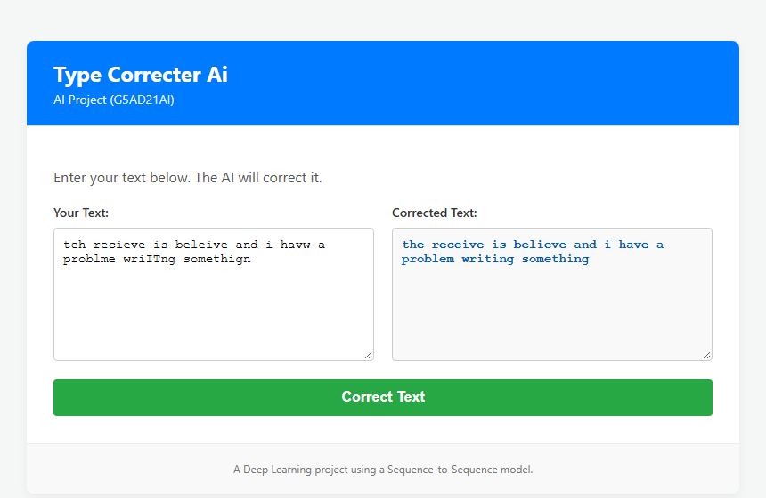

# Type Correcter AI

A small **Flask web app** that fixes typos in a block of text. Paste in
"teh recieve is beleive and i havw a problme", press **Correct Text**, and get
back "the receive is believe and i have a problem". The correction is done by a
character-level sequence-to-sequence neural network, served word by word with a
dictionary gate so it never changes a word that was already right.

> **Course:** Artificial Intelligence (G5AD21AI) — final project. The deliverable
> is a working web GUI that serves a trained Seq2Seq typo corrector.



## Where this fits (a 4-part exploration)

This is **Phase 3** of a four-project look at automatic typing correction:

1. **[invisible-autocorrect-extension](https://github.com/JampaniKomal/invisible-autocorrect-extension)** — a frequency dictionary (no ML).
2. **[Ghost-Type-Corrector](https://github.com/JampaniKomal/Ghost-Type-Corrector)** — a character-level seq2seq model, run inside a browser extension.
3. **Type Correcter AI** (this repo) — take that trained model **off the browser** and serve it from a Flask web app, so anyone can use it from a web page.
4. **[AI_Corrector_Project](https://github.com/JampaniKomal/AI_Corrector_Project)** — go system-wide with a T5 Transformer desktop corrector.

This project **integrates the model trained in Phase 2**. The web app itself
runs the model with **NumPy only — it does not need TensorFlow** — so the server
is small and starts instantly.

## How it works

```
browser ──POST /predict {"text": "..."}──> Flask (routes.py)
                                              │
                                              ▼
                                  predictor.Corrector.predict(text)
                                   │  split the text into words
                                   │  correct each word:
                                   │    - in the dictionary?  leave it
                                   │    - too short (a, i)?   leave it
                                   │    - else: beam-search the seq2seq model,
                                   │           take the best real-word candidate
                                   ▼
                              corrected text ──> {"correction": "..."}
```

- **The model** is the character-level encoder-decoder LSTM from Phase 2
  (`model/weights.npz`, ~3 MB), loaded once as a singleton when the app starts.
- **The dictionary gate** (`data/dictionary.txt`) makes the corrector safe to
  run over real text: a known word is never touched, short words like "a" and
  "i" are left alone, and a suggestion is only used if it is itself a real word.
- **Beam search** keeps several candidates and picks the best real word, which
  roughly doubles the correction rate over greedy decoding.

## Run it

```bash
pip install -r requirements.txt
python app.py
# open http://localhost:5000   (or http://localhost:5000/?demo for a filled-in example)
```

## Project structure

```
Type-Correcter-Ai/
├── app.py                         # entry point (Flask app factory)
├── requirements.txt               # flask + numpy (that's all it needs to serve)
├── model/
│   └── weights.npz                # the trained seq2seq weights (from Phase 2)
├── data/
│   ├── dictionary.txt             # the word list / correction gate
│   └── tokenizer_config.json
├── src/
│   ├── autocorrect/
│   │   └── predictor.py           # NumPy inference: beam search + dictionary gate
│   └── webapp/
│       ├── __init__.py            # create_app()
│       ├── routes.py              # GET / and POST /predict
│       ├── templates/index.html
│       └── static/{script.js,style.css}
├── tests/                         # predictor + Flask route tests
└── .github/workflows/ci.yml
```

## Tests

```bash
pip install -r requirements-dev.txt
pytest
```

CI runs ruff and the tests on Python 3.10–3.12. Everything is NumPy + Flask, so
it is fast.

## What changed from the archived version

The earlier version did not work as a typo corrector:

- **It used a word-level model.** The committed model (a bidirectional GRU over a
  whole-corpus word vocabulary — a 98 MB model and a **179 MB** tokenizer)
  treated each word as one token, so a misspelled word was simply an unknown
  token it could not fix, and it only "corrected" typos it had memorized. Typo
  correction is a **character**-level problem, which is exactly what the Phase-2
  model does — so this app now serves that model instead, as the project was
  always meant to ("integrates the trained AI from Prototype 2").
- **It needed TensorFlow to run.** The web app now serves the model with NumPy
  only, so the server is ~3 MB of weights instead of ~280 MB and needs no ML
  runtime.
- The hundreds of megabytes of training corpus were removed from the working
  tree (kept out of HEAD; the model is trained in Phase 2).

See [CHANGELOG.md](CHANGELOG.md).

## Limitations

- **One word at a time, dictionary-bounded** — it has no sentence context and
  cannot split or join words (`alot` → `a lot` is out of reach).
- **Small-model ceiling** — it fixes common single-typo words well, but misses
  two-error words (`definately` → `definitely`) and real-word errors.
- **Not deployed** — a local Flask development server; no auth, not hardened for
  the public internet.

## License

MIT — see [LICENSE](LICENSE).
